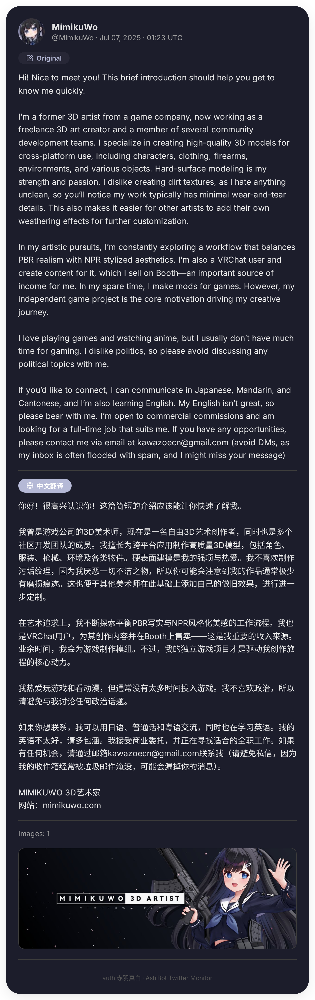
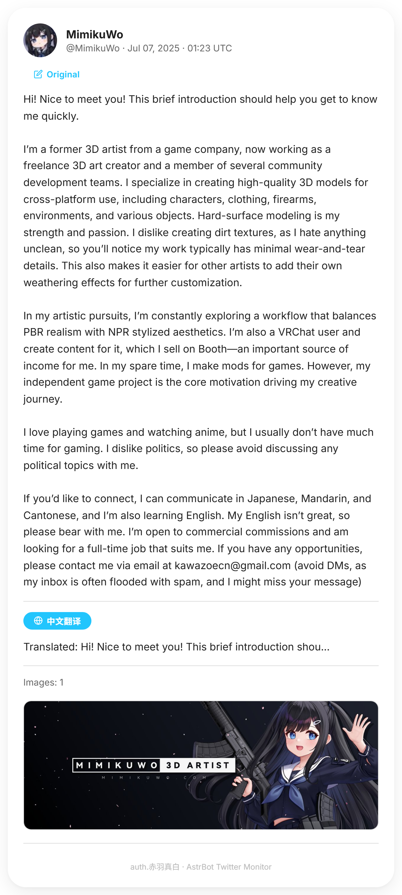

# ⚡ 电波推送 / AstrBot Plugin


<div align="center">

现代化 Twitter / X 推送插件  
支持 **LLM 翻译、图片 OCR、多图排版、Material Design 3 动态配色卡片**

<p>
  
  
  
  
</p>

</div>

---

## ✨ 功能特性

### 📡 推文监控
- 后台自动轮询 Twitter/X 新推文
- 支持指定账号订阅与实时推送
- 自动记录最新推文 ID，避免重复发送

### 🎨 MD3 动态卡片渲染
- 基于 Playwright 本地渲染 PNG 卡片
- Material Design 3 动态配色
- 自动提取图片主色调生成视觉主题
- 支持深色 / 浅色模式自动切换

### 🌐 AI 翻译
- 基于 AstrBot LLM Provider
- 支持：
  - 推文正文翻译
  - Article 长文翻译
  - NoteTweet 长推文翻译
  - 图片 OCR 文本翻译
  - 引用推文翻译

### 🖼 图片与媒体支持
- 单图全宽展示
- 多图智能网格布局（1 / 2 / 3 / 4 图）
- 视频 / GIF 自动发送
- Group Forward 合并推送，不刷屏

### 🤖 自然语言控制
集成 `@filter.llm_tool`，支持直接使用自然语言控制插件。

例如：

```text
关注 ApexLiveComms
取消关注 apex
推送 https://x.com/xxx/status/123
开启自动推送
```

---

# 🖼 预览

<div align="center">

| 深色模式 | 浅色模式 |
|---|---|
|  |  |

</div>

---

# 🚀 安装

## 1. 安装插件

在插件商店安装或使用链接安装
```text
https://github.com/LilycleHeart/astrbot_plugin_denpa_push
```

---

## 2. 安装依赖

```bash
pip install twikit==2.1.3 playwright jinja2
playwright install chromium
```

---

## 3. 安装 OCR（可选）

如果需要 `text_extraction` OCR 模式：

```bash
pip install easyocr
```

---

## 4. 重启 AstrBot

在 WebUI 中进入插件配置页面填写参数。

---

# ⚙️ 配置项

## WebUI → 插件配置

| 配置项 | 说明 |
|---|---|
| `twitter_auth_token` | Twitter Cookie 中的 `auth_token` |
| `twitter_ct0` | Twitter Cookie 中的 `ct0` |
| `text_translate_provider` | 文字翻译使用的 LLM Provider |
| `image_translate_provider` | 图片翻译使用的 LLM Provider |
| `image_translate_mode` | `multimodal` 或 `text_extraction` |
| `translation_language` | 翻译目标语言（默认：中文） |
| `poll_interval` | 推文轮询间隔（分钟） |

---

# 🍪 获取 Twitter Cookie

1. 打开 `https://x.com` 并登录账号
2. 按 `F12` 打开开发者工具
3. 进入：

```text
Application → Cookies → x.com
```

4. 复制以下字段：

```text
auth_token
ct0
```

填写到插件配置中即可。

---

# 🧩 指令

## 手动指令

| 指令 | 说明 |
|---|---|
| `/twitter add <username>` | 添加监控账号 |
| `/twitter remove <username>` | 移除监控账号 |
| `/twitter list` | 查看已关注账号 |
| `/twitter push <url>` | 手动推送单条推文 |
| `/twitter monitor` | 开启 / 关闭当前会话自动推送 |

---

## 🤖 AI 自然语言控制

需要开启 AI 对话功能。

| 示例 | 对应功能 |
|---|---|
| `关注 ApexLiveComms` | 添加监控 |
| `取消关注 apex` | 模糊匹配移除 |
| `推送 https://x.com/...` | 推送指定推文 |
| `列出已关注账号` | 查看监控列表 |
| `开启自动推送` | 开启当前会话推送 |

---

# 📁 数据存储

插件数据默认保存在：

```text
data/config/astrbot_plugin_twitter_monitor_data.json
```

包含：

- 已关注账号
- 最后推送推文 ID
- 自动推送会话列表

---

# 📦 项目结构

```text
astrbot_plugin_twitter_monitor/
├── main.py
├── twitter_client.py
├── templates/
│   └── tweet_card.html
├── metadata.yaml
├── _conf_schema.json
└── requirements.txt
```

---

# ❗ 注意事项

- QQ Official 平台不支持 Node 合并转发
- OneBot (aiocqhttp) 可正常使用 Group Forward
- 翻译依赖 AstrBot `llm_generate()`
- 使用前请确保已配置可用的 LLM Provider

---

<div align="center">


如果这个插件对你有帮助，欢迎 Star ⭐

</div>

